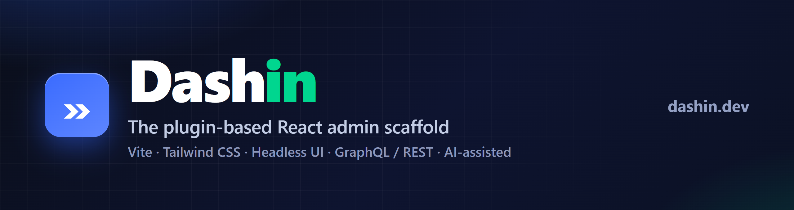

# Dashin — AI-assisted React admin dashboard scaffold



[](LICENSE)
[](https://demo.dashin.dev)
[](https://dashin.dev)
[](https://github.com/dashindev/dashin/pulls)

> **▶ Try the live demo — [demo.dashin.dev](https://demo.dashin.dev)** — a full e-commerce
> admin (dashboard + charts, products, orders, customers) running 100% free on Cloudflare D1.
> Log in with `admin` / `dashin`; it's fully editable and resets every 30 minutes.

**Dashin** is an open-source, plugin-based **React admin dashboard** scaffold built on **Vite + Tailwind CSS + Headless UI**. Point it at your backend — **Atomo (Rust Event Sourcing & CQRS), PocketBase, Payload CMS, Supabase, Appwrite, Directus, Turso, Strapi, or GraphQL/REST** — and Dashin gives you a **schema-validated CRUD admin panel**: tables, forms, filtering/sorting, auth, and i18n, ready to ship. It also supports **AI generation** whose output is validated against your real schema, so even cheap models produce a working admin — never freeform code. Routes, menus, CRUD pages, and auth are all plugins, and TipTap + Field-Blocks power visual and rich-text editing.

Dashin hopes to achieve as many function reuse as possible through simple development methods, so in each Dashin project, **common functions have been built**, such as dynamic routing, multi-level menus, **permission control, data management**, search filtering and sorting, CRUD, **file management, message notification**, documenting your code, etc. You only need to build your own plugin to call it, and the Dashin plugin is also easy to learn and use.

## Quick start

```bash
npm install --global @dashin-dev/cli

# Scaffold a project (interactive or flag-based)
dashin new my-dashin
# or scaffold a fullstack Rust Atomo + Dashin project:
dashin new my-dashin --atomo
```

Create a plugin
`$ dashin plugin [team]-[group]`
(Run in the plugins directory: plugins/)

Create a schema
`$ dashin schema [name]`
(Run in the plugin directory: plugins/dashin-plugin-[team]-[group]/)

Display help for command
`$ dashin --help`

[Read the Getting Started tutorial](https://dashin.dev/guide/getting-started)

## AI-assisted generation (BYOK)

Point Dashin at your backend and let AI generate a **validated** admin — cheap
models work because output is checked against your real schema, not freeform code.

```
# schema -> validated admin table
dashin ai generate --url <backend-url> --collection <name> --token <admin>

# description -> validated theme
dashin ai theme "dark mode with a purple accent"
```

Bring your own key: set `DASHIN_AI_PROVIDER` (openai | anthropic | ollama) +
`DASHIN_AI_API_KEY`. Full guide: [`docs/ai/README.md`](docs/ai/README.md).

## Backend connectors

Swap data sources via plugins — same table/CRUD UI on any backend:
**Atomo (Rust Core)** (`@dashin-dev/source-atomo` + `@dashin-dev/auth-atomo`),
**PocketBase** (`@dashin-dev/source-pocketbase`), **Payload CMS**
(`@dashin-dev/source-payload` + `@dashin-dev/auth-payload`), **Appwrite**
(`@dashin-dev/source-appwrite`), **Supabase**, **Directus**, **Turso**,
**Strapi**, **GraphQL**.
See [`docs/connectors/`](docs/connectors/) (or [`docs/payload/`](docs/payload/)).

## Online demo

**[demo.dashin.dev](https://demo.dashin.dev)** — a full e-commerce admin (dashboard
+ charts, products, orders, customers) running 100% free on Cloudflare D1.

- Username: `admin`
- Password: `dashin`

Fully editable; the demo data resets every 30 minutes.
[More details](https://dashin.dev/guide/demo)

## Development

```shell script
git clone git@github.com:dashindev/dashin.git

yarn
yarn tsc:build        # required once — builds all package lib/ for the plugin generator
yarn tsc:watch
yarn dev

# minimum command
$ yarn workspace @dashin-dev/dashin tsc:watch
$ yarn workspace @dashin-dev/auth-local tsc:watch

$ yarn dev
```

The dev server (Vite) runs at [http://localhost:3000](http://localhost:3000).

- Username: `admin`
- Password: `dashin`

### Scripts

Inside `packages/dashin`:

| Command          | Description           |
| ---------------- | --------------------- |
| `yarn dev`       | Vite dev server       |
| `yarn build`     | Vite production build |
| `yarn test`      | Vitest                |
| `yarn typecheck` | tsc app type-check    |

From the repo root:

| Command                | Description                |
| ---------------------- | -------------------------- |
| `yarn tsc:build`       | Build all packages (lerna) |
| `yarn turbo:tsc:build` | Build all packages (turbo) |

## Lerna (publish packages)

```
yarn tsc:build        # build all package lib/ first (publish ships lib/, not src)

# First 2.0 release is an alpha — publish under the `alpha` dist-tag so it
# doesn't take the default `latest` tag:
npx lerna publish from-package --dist-tag alpha

# Later, to cut a stable release:
#   npx lerna version 2.0.0 --no-private
#   npx lerna publish from-git
```

#### Thanks

[tailwindcss](https://github.com/tailwindlabs/tailwindcss)
[headlessui](https://github.com/tailwindlabs/headlessui)
[tiptap](https://github.com/ueberdosis/tiptap)
[vite](https://github.com/vitejs/vite)
[formik](https://github.com/jaredpalmer/formik)
[ngx-admin](https://github.com/akveo/ngx-admin)
[ant-design-pro](https://github.com/ant-design/ant-design-pro)
[react-admin](https://github.com/marmelab/react-admin)

❤️🎉
