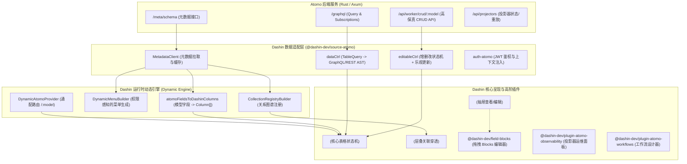

# Dashin + Atomo 深度融合架构实施方案

> **文档版本**：v1.0  
> **编制日期**：2026-09-06  
> **实施目标**：将 Dashin 现代前端 Admin 框架与 Atomo 高性能 Rust Content Core 深度融合，实现**纯运行时动态 Schema 驱动、企业级关系穿透、Notion-style Blocks 深度编辑与专属运维监控**，构建一套在性能、开发体验和架构维度全面超越 PayloadCMS 的新一代全栈开源解决方案。

---

## 1. 架构背景与战略目标

### 1.1 背景现状
- **Dashin**：具备成熟的工业级 React Admin UI 抽象（`CrudTable`、`DetailDrawer`、`RelatedPreview`、TipTap 富文本、Tailwind 设计 Token 与 i18n 国际化），但过去侧重静态/脚手架插件模式，缺乏官方主打的自研高性能后端底座。
- **Atomo**：具备世界级的 Rust 事件溯源（Event Sourcing）+ CQRS 高性能后端，通过 TypeScript DSL 声明模型与 Actions/Workers，但在前端仅维护了一套相对轻量的 `atomo-admin-ui`，在复杂 UI 交互、设计系统完备度与二次开发体验上亟待升级。

### 1.2 战略目标
1. **零前端代码动态自发现**：读取 Atomo 的 `/meta/schema`，Dashin 即可在运行时动态构建左侧菜单、动态路由、数据表格与抽屉表单。
2. **交互降维超越**：将 Atomo 的单页跳转升级为 Dashin 的**层叠抽屉（Stacked DetailDrawer）+ 关系穿透（`RelatedPreview`）**，支持多层钻取与防环保护。
3. **高阶资产复用**：将 Atomo 现有的 `EnhancedBlocksEditor`（拖拽块系统）、`ObservabilityView`（投影器监控）和 `WorkflowDesigner`（工作流设计器）封装为 Dashin 插件。
4. **统一标准全栈分发**：提供 Docker 一键运行与 CLI 模板，实现单机 `< 50MB` 内存、`10,000+ QPS` 的企业级全栈交付能力。

---

## 2. 总体技术架构设计



---

## 3. 分阶段落地实施方案

### Phase 1: 契约连接器与鉴权层 (`@dashin-dev/source-atomo`)

#### 1.1 模块定位与职责
在 `packages/dashin-source-atomo` 中实现 Dashin 标准数据驱动接口，将 Atomo 的通讯协议抹平为 Dashin 通用的 `TableQuery`、`EditableData` 规范。

#### 1.2 核心接口设计与数据契约
```typescript
// packages/dashin-source-atomo/src/types.ts
export interface AtomoFieldMeta {
  name: string
  type: 'string' | 'number' | 'boolean' | 'datetime' | 'select' | 'relation' | 'blocks' | 'json'
  optional: boolean
  attributes: ('primary' | 'unique' | 'index' | 'required' | 'readonly')[]
  relationship?: {
    type: 'many_to_one' | 'one_to_many'
    model: string
    foreignKey: string
  }
}

export interface AtomoModelMeta {
  tableName: string
  primaryKey: string
  fields: Record<string, AtomoFieldMeta>
  relationships?: Record<string, any>
  access?: Record<string, string>
  ui?: {
    listView?: string[]
  }
}

export interface AtomoSchemaMeta {
  models: Record<string, AtomoModelMeta>
}
```

#### 1.3 `dataCtrl` 查询映射器实现逻辑
将 Dashin 的前端 `TableQuery` 转换为高效的查询载荷：
- **分页**：`page` (1-based) 与 `pageSize` 映射到分页参数。
- **排序**：`orderBy` 与 `orderDirection` 映射为 `sort: { field: "asc" | "desc" }`。
- **过滤筛选**：
  | Dashin Operator | Atomo Where Clause |
  | :--- | :--- |
  | `=` / `equals` | `{ [field]: { equals: val } }` |
  | `contains` | `{ [field]: { contains: val } }` |
  | `>` / `>=` | `{ [field]: { greaterThan: val } }` |
  | `<` / `<=` | `{ [field]: { lessThan: val } }` |
  | `in` | `{ [field]: { in: [vals] } }` |

---

### Phase 2: Dashin 运行时动态 Schema 引擎 (Dynamic Schema Engine)

#### 2.1 动态模型到 Columns 映射算法
编写 `atomoFieldsToDashinColumns(modelMeta: AtomoModelMeta): Column<any>[]`：
1. 遍历 `fields`，根据 `modelMeta.ui?.listView` 决定默认展示列。
2. 基础类型映射：
   - `string` / `email` / `url` -> `type: "string"`
   - `number` -> `type: "numeric"`
   - `boolean` -> `type: "boolean"`
   - `datetime` -> `type: "datetime"`, 自定义格式化格式。
   - `select` -> 提取 options 转换为 Dashin 的 `lookup` 下拉字典。
3. 关联字段映射：
   - 提取 `relationship`，为该列注入 `renderDetail`，返回 `<RelatedCard slug={rel.model} value={row[rel.foreignKey]} />`。

#### 2.2 动态通配路由容器设计
```tsx
// packages/dashin/src/components/DynamicAtomoEntity/index.tsx
export default function DynamicAtomoEntity() {
  const { modelName } = useParams<{ modelName: string }>()
  const { schema, loading } = useAtomoSchema()
  
  if (loading) return <Spinner />
  const model = schema.models[modelName]
  if (!model) return <NotFound message={`Model ${modelName} not found`} />

  const columns = useMemo(() => atomoFieldsToDashinColumns(model), [model])
  
  return (
    <CrudTable
      title={capitalize(modelName)}
      columns={columns}
      data={query => atomoDataCtrl({ query, model: modelName })}
      editable={atomoEditableCtrl({ model: modelName })}
    />
  )
}
```

#### 2.3 动态侧边栏菜单生成
在 Dashin 启动时，调用 `DynamicMenuBuilder`：
- 读取 `schema.models` 键集合；
- 过滤当前登录用户角色的 `access.read` 权限；
- 动态生成 Dashin 侧边栏菜单树，支持自动分组（如平台模型、业务模型）。

---

### Phase 3: 交互体验升维与关系穿透 (`RelatedPreview`)

#### 3.1 关系图谱自动注册
通过 Atomo 的关系定义，自动组装 Dashin 的 `CollectionRegistry`：
```typescript
export function buildAtomoRegistry(schema: AtomoSchemaMeta, client: AtomoClient): CollectionRegistry {
  const registry: CollectionRegistry = {}
  for (const [slug, model] of Object.entries(schema.models)) {
    registry[slug] = {
      meta: {
        label: capitalize(slug),
        title: r => r.name || r.title || r.id,
        subtitle: r => r.email || r.description || '',
        relations: extractRelations(model)
      },
      columns: atomoFieldsToDashinColumns(model),
      fetch: id => client.fetchOne(slug, id),
    }
  }
  return registry
}
```

#### 3.2 关系穿透用户旅程
1. 用户在“订单 (Orders)”列表点击一条记录，右侧平滑滑出 `DetailDrawer`；
2. 客户字段自动渲染为卡片状的 `<RelatedCard slug="customers" value="cust_123" />`；
3. 用户点击卡片，Dashin 的 `RelatedPreviewProvider` 自动在右侧堆叠滑出第二层“客户详情”抽屉；
4. 客户详情中点击“关联的所有订单”，滑出第三层，且由 **Loop Guard** 确保不发生循环递归。

---

### Phase 4: Atomo 独门资产吸收与插件化

#### 4.1 块编辑器插件 (`@dashin-dev/field-blocks`)
- 将 `atomo-admin-ui/src/components/forms/EnhancedBlocksEditor.tsx` 与 `DragDropHelpers.tsx` 提取出来；
- 去除对外部特定样式的硬编码依赖，统一接入 Dashin 的 Design Tokens（`bg-content-box`、`border-bn-border` 等）；
- 提供富文本块、代码块、列表块、引用块、图片块，直接保存在模型的 `json` / `blocks` 字段中。

#### 4.2 投影器与事件运维面板 (`@dashin-dev/plugin-atomo-observability`)
- 移植 `ObservabilityView`，重构为符合 Dashin 规范的统计大屏；
- 展示指标：
  - Event Store 写入吞吐量 (QPS)
  - 各 Projector 的处理位点与延迟 (Lag)
  - 错误日志与死信队列
- 提供功能：一键触发 `Replay Projector`，利用事件重放修复读模型。

#### 4.3 工作流设计器插件 (`@dashin-dev/plugin-atomo-workflows`)
- 移植 `WorkflowDesigner`，通过拓扑图可视化展示 Atomo 的 Actions、触发器与外部 Workers 的分发链路。

---

### Phase 5: 全栈脚手架闭环与生态切换

#### 5.1 Docker 一键全栈交付
编写 `docker-compose.fullstack.yml`：
- `atomo-core`: Rust 后端镜像（暴露 3000 端口，包含 GraphQL 与 /meta/schema）。
- `postgres`: 带有 `pgvector` 扩展的数据库。
- `dashin-admin`: Dashin Vite 预构建的 Nginx 静态镜像（暴露 80/443 端口），配置好反向代理。

#### 5.2 官方替代路线与弃用指引
1. 在 `atomo` 仓库发布公告，正式将 Dashin 作为推荐的官方 Admin UI 解决方案。
2. 将 `packages/atomo-admin-ui` 置为维护/兼容模式，指引新用户使用 Dashin 全栈模板。
3. 统一两端文档，形成 **“Atomo 驱动核心，Dashin 驱动体验”** 的品牌合力。
